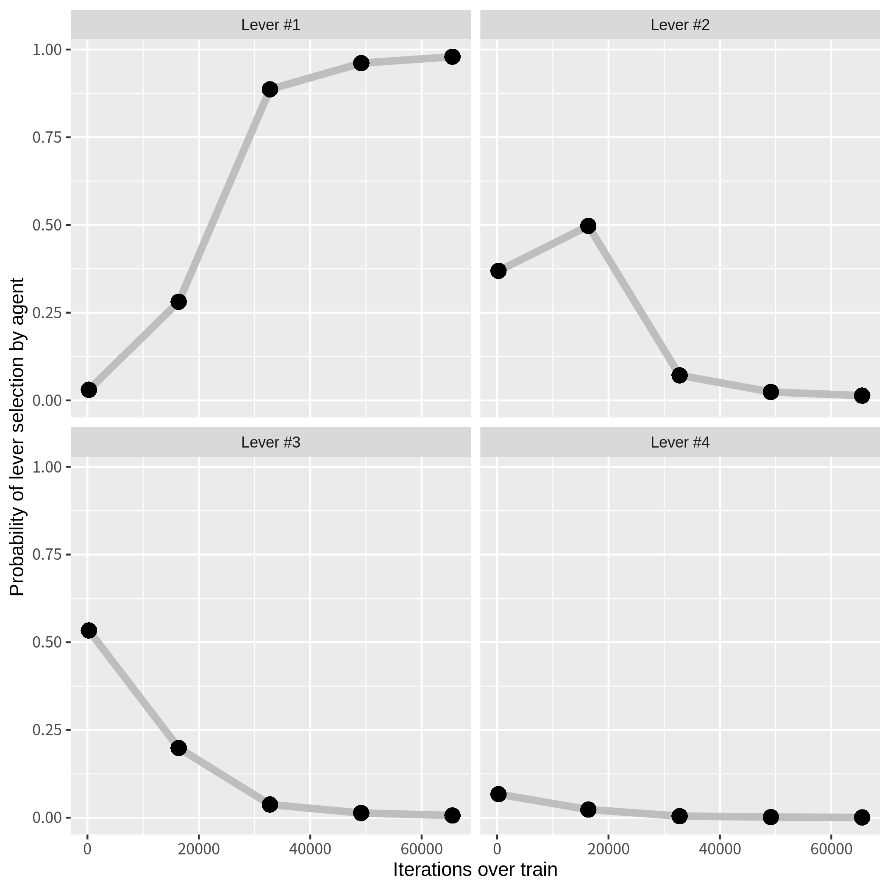
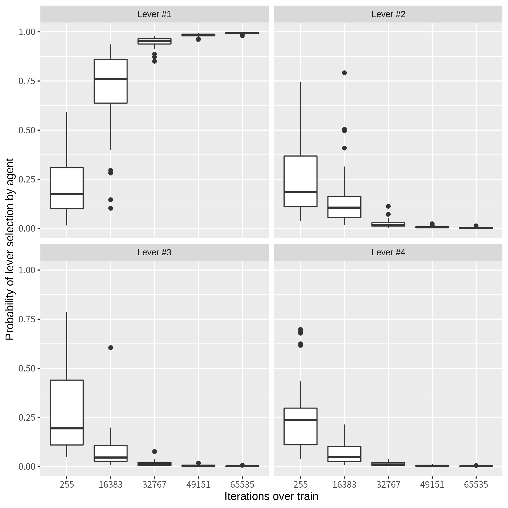

# Introduction 

A training framework for actor critic methods is being constructed.

This short text mentions about the parameter convergence during training processes
in order to verify the validity of the implementation of the framework.

A multiarmed bandit problem is chosen as a target plant
because, although AC methods are usually applied to the continuous action control problem,
it's possible to simplify the implementation and the test of the critic procedure,
of which the log trick might cause the difficulty of convergence,
in a discrete action plant.

# Target environment

Here is the detail of the bandit problem:
- It has the four levers.
- Every time an agent plays a game, each lever independently gives a unit reward (=1) with the following identical probability
In this setting, selecting the first lever is the unique optimal policy for the agent.

Table1. the rewarding probability of levers

<table>
<tr>
<th>Lever</th><th>Probability</th>
</tr>
<tr><td align="center">1    </td><td align="center">  0.5      </td></tr>
<tr><td align="center">2    </td><td align="center">  0.25     </td></tr>
<tr><td align="center">3    </td><td align="center">  0.125    </td></tr>
<tr><td align="center">4    </td><td align="center">  0.125    </td></tr>
</table>

# Tests

## Test #1

In this first test,
one agent is trained with the following setting:
- Update the policy of the agent and the value function approximator by Adam optimizer, respectively.
	- The learning rates of the optimizer for each network are set 0.001 as default value in Tensorflow.Keras.
- Update the policy once every ten times of value updates
- Initialize the parameter of the policy with a set of random values.

The figure below shows the result of the parameter convergence of this training procedure.
You can notice...
- The policy is approaching to the optimal policy(selecting the first lever)

Fig1: the result of the parameter convergence over the training of the single agent

## Test #2

The second test multiplies the first test many times
in order to strengthen the validity of training framework.
In addition to the setting of the first test,
- 30 agents are trained.

In the fig.2, you can observe that 
- all the agents approach to the optimal policy with the random initial setting.

Fig2: the result of the parameter convergence over the training of multiple agents

# Summary

Easiest tests have been done in the training framework for actor critic methods.
Further tests would come soon.

